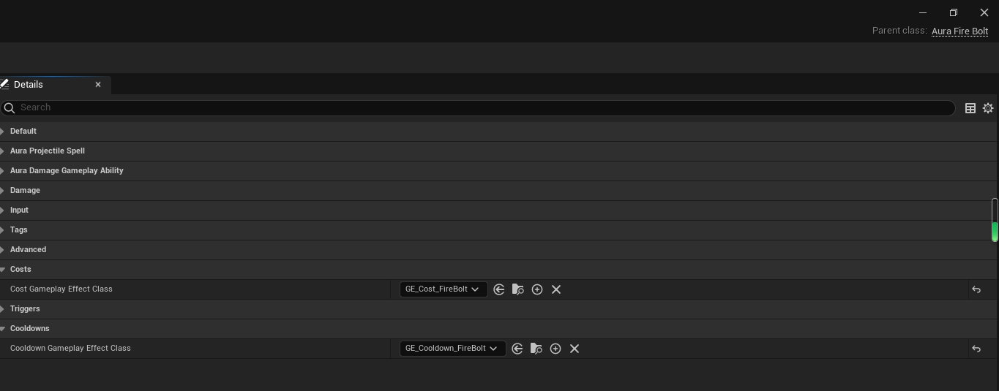

My Aura source codes of [Unreal Engine 5 - Gameplay Ability System - Top Down RPG](https://www.udemy.com/course/unreal-engine-5-gas-top-down-rpg/). 

A little different from his.

All copyrights to him. But if you buy his course, you call use these assets commercially.

## After class question

### 25 Spell Menu

#### question 1

> We have two types of Spells: Offensive, and Passive. 
> Can you think of another type of Spell, and how you would want it to behave? 
> Write your answer in a short paragraph and share it in the 🔥｜gas-top-down-rpg channel in the Druid Mechanics Discord Community.

#### question 2

> We needed to pass the level into GetDescription. Why couldn’t we get it from the class itself?

To answer this question, we have to find where the "GetDescription" is. It's in `AuraAbilitySystemComponent` and it is called `GetDescriptionsByAbilityTag`. 
Why should we get it directly from `GameplayAbility`. This is because that `GameplayAbility` doesn't have a property called `Level`, the `GameplayAbilitySpec`does.
So it makes sense that `GetDescriptionsByAbilityTag` is located in `AuraAbilitySystemComponent`, and pass `Level` into `GetDescriptionsByAbilityTag`.

#### question 3

> We were able to get the Cost from the Ability class itself, but this makes the following assumptions:

We should check the "Cost" in `GA_FireBolt`. It has "Costs" which is called `GE_Cost_FireBolt`. 

So check out `GE_Cost_FireBolt`.

#### question 4

> To get the Cooldown from the Ability itself:

Check out `GE_Cooldown_FireBolt`.

## 一些可能有用知识点

1. 394 Traveling to Saved Map 有可能有修复字体超出空间的方法

